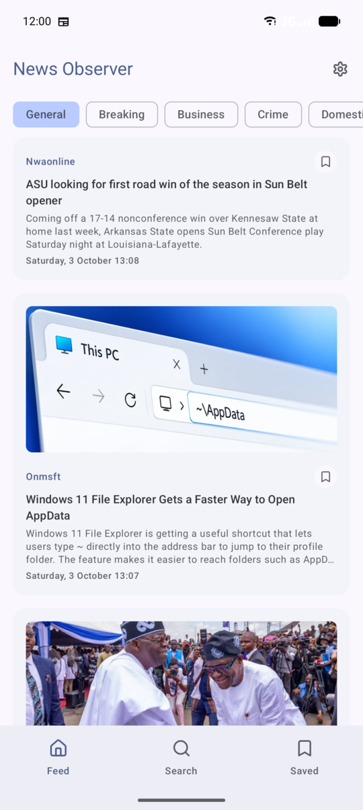
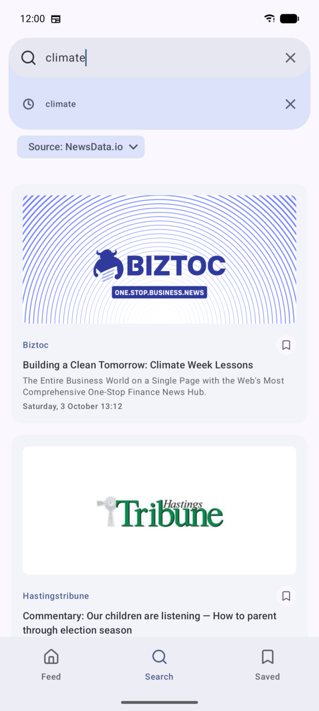
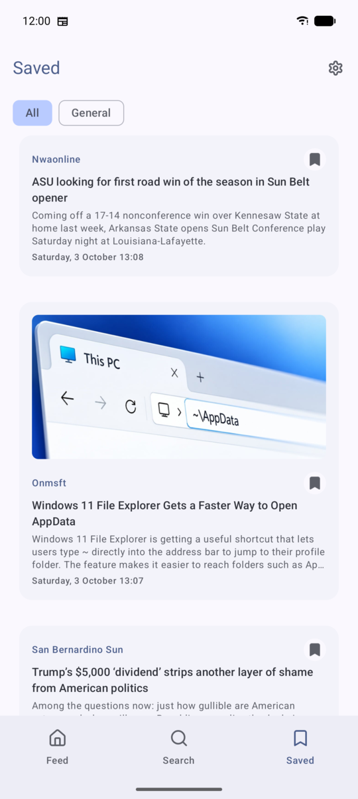
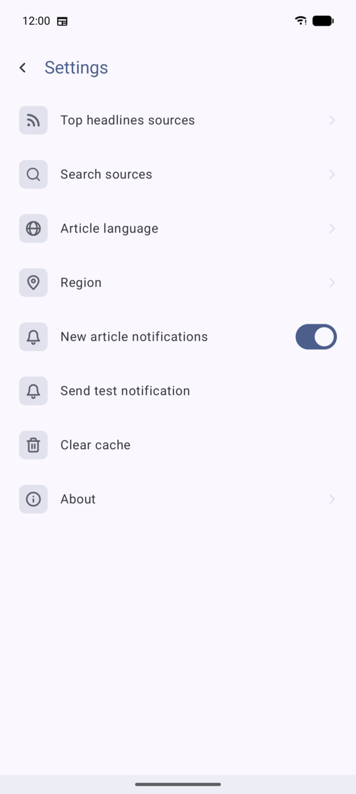

# News Observer


An Android news aggregator built as a learning / portfolio project.
It pulls headlines from several public news APIs, caches them locally, lets you search
and save articles, and can notify you about new stories in the background.

<p align="center">
  
  
  
  
</p>

## Features

- **Feed** of top headlines with category filters and infinite scroll
- **Search** across sources with search history
- **Saved** articles available offline
- **Settings**: news sources, language, region, cache clearing
- **Background notifications** about new articles
- Articles open in Chrome Custom Tabs — the app links to the original publication

## Tech stack

| Area       | Libraries                                             |
|------------|-------------------------------------------------------|
| Language   | Kotlin, Coroutines, Flow                              |
| UI         | Jetpack Compose, Material 3, Navigation Compose, Coil |
| DI         | Hilt                                                  |
| Network    | Retrofit, OkHttp, Gson                                |
| Storage    | Room, DataStore Preferences                           |
| Paging     | Paging 3 with `RemoteMediator`                        |
| Background | WorkManager                                           |
| Tests      | JUnit, kotlinx-coroutines-test, Room migration tests  |

## Architecture

Single-module app following Clean Architecture with MVVM in the presentation layer.

```
presentation  →  Compose screens + ViewModels (UI state via StateFlow)
      ↓
domain        →  models, use cases, repository interfaces (pure Kotlin)
      ↑
data          →  repository implementations, Room, DataStore, news providers
```

- **Offline-first feed.** Paging 3 `RemoteMediator` loads pages from the network into Room;
  the UI always reads from the database, so cached news is available without a connection.
- **Pluggable news providers.** Each API (NewsData.io, GDELT) implements a common
  `NewsProvider` interface and is registered via a Hilt multibinding map. Adding a source
  doesn't touch the rest of the app.
- **Build-type isolation.** The debug build adds an extra provider (NewsAPI, dev-only license);
  a release unit test guards that it never ships.

## Build

Requires an API key from [NewsData.io](https://newsdata.io). Add it to `local.properties`:

```properties
NEWS_DATA_API_KEY=your_key
# optional, debug builds only
NEWS_API_KEY=your_key
```

Then:

```bash
./gradlew assembleDebug
```

## Legal

News content belongs to its original publishers; the app shows only headlines, short
descriptions and links. See the [privacy policy and terms](docs/index.md).

## License

Source code is released under the [MIT License](LICENSE).
